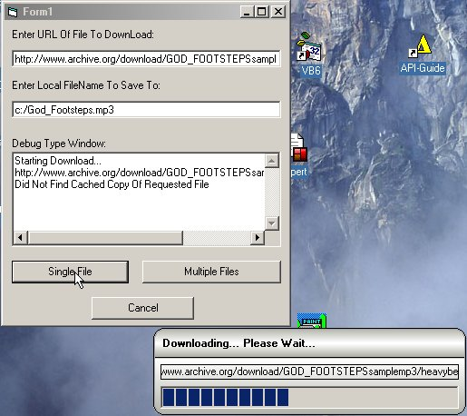

<div align="center">

## A URLDownloadToFile Demo WITH PROGRESS bar/CANCEL Update: 18 May 2010


</div>

### Description

Updated 18 May 2010: The IBindStatusCallback events for URLDownloadToFile are in a class module for easier use/portability. The class now supports download progress bar(s) AND CANCEL with 5 extra events exposed. Now you can add progress bars to your downloads... and free your app from waiting while the file(s) download. I have included an easily modifiable download window to show the progress of your downloads while your app does something else (see the screen shot). It will do multiple downloads with progress. I give you my personal guarantee that you'll find nothing like this on PSC! I did not write this code for this purpose, but you could easily use this code to download a list of updated files (from the internet), then parse the file list and 'auto-update' the files on the local computer. I have also included a DeleteUrlCacheEntry routine from the Wininet api to force a 'fresh copy' download from the internet. Otherwise, URLDownloadToFile will often download a local copy of the requested file that is cached in IE. The project DOES need a type library (freely downloaded) and complete instructions are in the zip. The type lib. is NOT distributed with your app... needed parts are compiled into your project by VB. As is my want, there are more comments than code. If you just started writing VB code this morning, you can download this dude and have it running in 5 minutes AND you'll understand the whole process in 10 minutes! Semi-Guaranteed as usual! BE SURE TO READ THE READ_ME_FIRST.TXT File for instructions on how to get and install the FREE type library needed!

Your most ardent admirer,

CptnVic
 
### More Info
 
URL of file(S) to download (any type file o.k.)

The type library must be:

1)Downloaded

2)Registered locally

3)Referenced

Complete instructions are in the zip.

Downloaded File

None, or I wouldn't post the demo!


<span>             |<span>
---                |---
**Submitted On**   |2010-05-18 16:38:00
**By**             |[CptnVic](https://github.com/Planet-Source-Code/PSCIndex/blob/master/ByAuthor/cptnvic.md)
**Level**          |Intermediate
**User Rating**    |4.5 (81 globes from 18 users)
**Compatibility**  |VB 4\.0 \(32\-bit\), VB 5\.0, VB 6\.0
**Category**       |[Internet/ HTML](https://github.com/Planet-Source-Code/PSCIndex/blob/master/ByCategory/internet-html__1-34.md)
**World**          |[Visual Basic](https://github.com/Planet-Source-Code/PSCIndex/blob/master/ByWorld/visual-basic.md)
**Archive File**   |[A\_URLDownl2181335182010\.zip](https://github.com/Planet-Source-Code/cptnvic-a-urldownloadtofile-demo-with-progress-bar-cancel-update-18-may-2010__1-64914/archive/master.zip)

### API Declarations

```
Several, all well documented/commented.
See the zip
```


